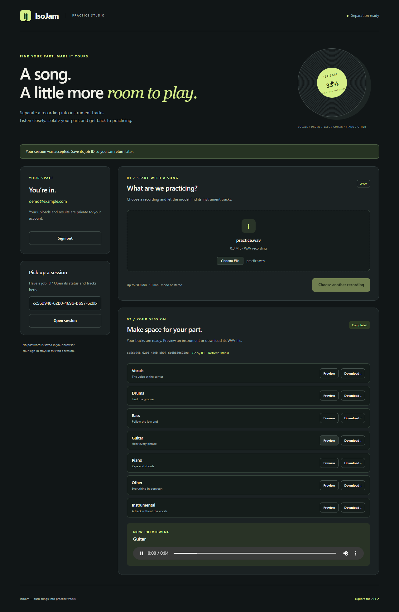
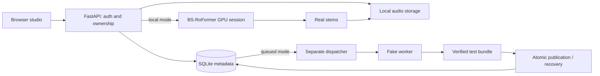

# IsoJam

[](https://github.com/Ian0520/isojam/actions/workflows/backend.yml)

**Turn songs into practice tracks.** Upload a WAV recording, separate its
instruments with BS-RoFormer, then preview or download the stems in a browser.

IsoJam is a backend-focused personal project built with Python, FastAPI,
SQLAlchemy, SQLite and a pretrained audio model. It includes a working local GPU
demo and a separate containerized worker exercise for learning reliable delivery.



[Watch the 14-second local demo](docs/demo/real-separation.webm) ·
[Demo and verification evidence](docs/demo.md) ·
[Setup and API guide](docs/configuration.md) ·
[Container guide](docs/containers.md)

## What works

- Account registration and login with Argon2 password hashing and JWT access tokens.
- Authenticated WAV uploads with request, file-size, duration and decoded-audio validation.
- Ownership checks on uploads, jobs and stem downloads.
- Browser submission, status polling, session restoration by job ID, playback and downloads.
- Seven outputs: vocals, drums, bass, guitar, piano, other and instrumental.
- Persistent metadata with Alembic migrations, per-user unfinished-job limits and idempotent job submission.
- A non-root CPU API container with hash-locked dependencies and persistent storage.
- A separate queued fake-worker path with execution authorization, verified result bundles, atomic publication and restart recovery.
- GitHub Actions covering lint, formatting, tests, container packaging and interrupted-publication recovery.

## Two processing paths

| Path | Purpose | Execution and recovery |
| --- | --- | --- |
| `local` | Real source separation in the browser | Loads the GPU model once; runs FastAPI background tasks. Interrupted inference is not resumed after restart. |
| `queued` | Container and reliability exercise | A separate dispatcher runs a fake worker that makes test WAVs. It can recover publication after confirmed worker exit without launching another execution. |
| `disabled` | CPU API and existing-result access | Authentication, uploads, status and downloads work; new jobs return 503. |

The CPU Docker image defaults to `disabled` and does **not** contain the model.
The real GPU model is **not yet connected to the queued worker path**. An unknown
worker exit keeps its queue slot occupied; an old heartbeat alone is not enough
to authorize replacement.



## Try the local GPU demo

Use Ubuntu/WSL2, Python 3.12 and the existing CUDA inference environment.
Follow the [setup guide](docs/configuration.md#setup) to install the inference
extra, configure a signing secret and apply migrations. Then, from `backend`:

```bash
source .venv/bin/activate
export ISOJAM_PROCESSING_MODE=local
uvicorn app.main:app --host 127.0.0.1 --port 8000
```

Open [http://127.0.0.1:8000/](http://127.0.0.1:8000/), create an account, choose a
short WAV and select **Separate audio**. Save the job ID to reopen the session
later. API documentation is at `/docs`. See the [demo guide](docs/demo.md) for
prerequisites and the tested workflow.

## Verify without a GPU

With a running Linux Docker engine, from the repository root:

```bash
docker build --platform linux/amd64 -t isojam-api:ci backend
python3 backend/scripts/check_container.py --image isojam-api:ci
python3 backend/scripts/smoke_container.py --image isojam-api:ci
python3 backend/scripts/smoke_container.py --image isojam-api:ci --processing-mode queued --dispatch-fake-worker --recover-publication
```

The checks use disposable databases, audio directories and Docker resources.
They test the installed CPU image and preserve existing project data. The full
locked suite currently has **1,064 passing tests**. These checks use fake model
sessions; the real GPU browser flow is validated separately.

See [CI](docs/ci.md) for workflow details and [containers](docs/containers.md) for
manual operation with your own persistent volume.

## Scope and limitations

This is a working local demo and tested backend, not a public hosted service.
Metadata is SQLite and audio is local storage. The browser uses tab-scoped access
tokens, which expire after 30 minutes; refresh tokens are not implemented.
Preview fetches a whole authenticated WAV before playing it.

Local inference has no global GPU scheduling limit or restart recovery. The
queued path currently processes fake audio, uses one global slot, and requires
explicit dispatcher cycles. AWS hosting, remote GPU execution, MySQL and Redis
integration remain future work. Custom backing-track mixing, speed adjustment
and a job-history list are not yet implemented.

## Explore the project

- [Configuration and API reference](docs/configuration.md)
- [Docker operation and smoke tests](docs/containers.md)
- [Continuous integration](docs/ci.md)
- [Demo recording and measured evidence](docs/demo.md)
- [Operations and troubleshooting](docs/operations.md)
- [Design notes and tradeoffs](docs/design-notes.md)
- [Worker design](docs/worker-design.md)
- [Original model compatibility spike](docs/model-spike.md)
- [Product direction](docs/project-scope.md)
