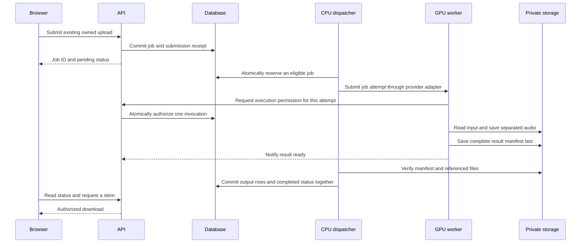

# Durable job execution for the invited beta

Status: design proposed on 2026-10-02, with implemented slices recorded below.
The document itself changes no runtime behavior. Hosting provider and monthly budget remain undecided; selecting this
design does not provision or purchase anything.

## Recommendation and reading guide

Keep accepted work in the database, run a separate CPU dispatcher, and execute
inference in a GPU worker. Start with one active attempt globally. Prove the
contract locally with a fake worker before integrating private object storage and
a selected GPU provider.

Read sections 1-3 first: the current gap, component responsibilities, and normal
flow. Sections 4-7 specify the recovery rules we will implement in small stages.
The final sections describe tradeoffs, acceptance checks, and learning milestones.

## 1. Baseline before worker implementation

This baseline was reviewed before the metadata migration below.

In local mode, `POST /jobs` checks authentication/ownership and the per-user
unfinished-job allowance, inserts a pending job, commits, and adds `process_job`
to FastAPI's `BackgroundTasks`. The model is loaded in the API lifespan.

`process_job` loads the upload, marks processing, runs separation, then inserts
output rows and marks completed in one database transaction. Ordinary exceptions
attempt to mark failed. These are useful foundations, but process termination
cannot be handled by an exception handler that no longer runs.

The job has only `id`, `upload_id`, and `status`. There is no execution owner,
attempt history, deadline, or restart scanner. Two calls to `process_job` are not
protected by an atomic claim. Outputs are written directly into a job directory,
and output rows contain absolute filesystem paths. A retry can encounter partial
files or existing `(job_id, stem)` rows. Current fake inference fixtures return
paths without creating output files, so completion tests will also need real
small WAV artifacts when publication starts verifying their contents.

A concrete failure: commit a pending job, then stop the API before its background
task starts. The job survives in SQLite, but nothing discovers it after restart.
A stop during inference can similarly leave a job marked processing indefinitely.
Both also continue to consume the user's unfinished-job allowance.

The CPU container currently uses disabled mode and rejects new jobs with 503;
it has not been running this local inference path during our container exercise.
FastAPI describes its background tasks as work after the response, and recommends
separate tools for heavy computation across processes or servers.
[FastAPI background tasks](https://fastapi.tiangolo.com/tutorial/background-tasks/)

Relevant existing files:

- [Job submission and downloads](../backend/app/routers/jobs.py)
- [Current processing function](../backend/app/processing.py)
- [Job persistence and admission](../backend/app/repositories/jobs.py)
- [Models](../backend/app/db_models.py)
- [Storage paths](../backend/app/storage.py)
- [Inference wrapper](../backend/app/separation.py)
- [Existing processing tests](../backend/tests/test_processing.py)

## 2. Responsibilities and deployment boundary

| Component | Responsibility | State it owns |
| --- | --- | --- |
| API | Authenticate users, accept uploads/jobs, expose status and authorized downloads | Submission records, jobs, publication metadata |
| CPU dispatcher | Discover eligible work, reserve attempts, submit/reconcile execution, finalize results | Durable attempt/dispatch records |
| GPU worker | Obtain execution permission, read input, run inference, save a result manifest | Temporary workspace and durable attempt outputs |
| Private storage | Exchange uploads and outputs across machines | Audio objects and result manifests |

The dispatcher is a separate process. It survives an API container replacement
when its own process stays running, and reconstructs its work from the database
when it also restarts. A supervisor must restart these services; persistence
alone does not start a stopped process.

For the SQLite beta, API and dispatcher run on the same CPU host with the same
locally attached database. Transactions are short; no database lock is held while
calling a provider, transferring files, loading the model, or running inference.
The remote GPU worker communicates through authenticated control operations and
private storage. It does not mount or open the SQLite database remotely.
SQLite's documentation recommends keeping database access on the machine holding
the file or using a client/server database for remote clients.
[SQLite network guidance](https://www.sqlite.org/useovernet.html)

This requires a host that supports the dispatcher and persistent local storage.
Do not assume two independently hosted services can attach the same disk. If the
chosen host cannot support this topology, select a network database such as
PostgreSQL and revisit transaction/isolation behavior before implementing that
hosting adapter. Horizontal API replicas are outside the initial SQLite design.

For local contract tests, a fake worker uses a disposable local filesystem. A
later same-host GPU runner can use shared audio storage; hosted GPU workers need
private object storage because a Docker named volume is local to its Docker host.

## 3. Successful job, step by step

1. Uploads are validated and durably stored before they can be used for remote
   processing. If storage fails, submission cannot reference an unavailable input.
2. The API commits accepted work before responding. The public response remains
   the current 200 initially, with pending status; acceptance does not mean done.
3. The dispatcher periodically scans committed eligible jobs. There is no
   separate mandatory in-memory notification between acceptance and discovery.
4. It reserves one attempt in a short transaction and records submission intent
   before contacting the execution adapter.
5. The worker obtains permission for that exact attempt and invocation before
   inference. It uses a private workspace and writes outputs under its own prefix.
6. It stores all required files, then an immutable manifest containing their keys,
   sizes and SHA-256 hashes. The manifest is evidence of a complete output set.
7. The dispatcher verifies results and commits output rows plus completed status
   together. Downloads remain authorized through the existing job/upload owner.

This avoids the current commit-to-background-task gap. Sending to another system
still has a separate acknowledgement gap; section 5 handles it. Database commit
plus external notification is a general dual-write problem described by the
[transactional outbox pattern](https://docs.aws.amazon.com/prescriptive-guidance/latest/cloud-design-patterns/transactional-outbox.html).
Here the committed job is the work item scanned by the dispatcher. A separate
outbox table becomes useful if we later introduce a broker/event stream.

## 4. Persistent state and claiming work

Keep the public statuses `pending`, `processing`, `completed`, and `failed`.
Pending includes waiting for a worker/cold start; processing begins when an
invocation is authorized. Completed and failed are terminal for that job.
A retry is another attempt under the same job, while an explicit new user request
can create a new job. Both pending and processing continue to count toward quotas.

Proposed schema additions (exact names belong to the schema implementation):

| Record | Information to persist |
| --- | --- |
| Job | Execution backend, created/updated timestamps, next eligible time, active attempt reference, bounded retry policy, safe public error code |
| Submission receipt | User ID and idempotency key, request fingerprint, job ID; unique per user/key |
| Job attempt | Job ID/attempt number, phase, dispatcher owner/generation, invocation ID, heartbeat/deadline, provider reference, expected storage prefix, terminal outcome, scoped credential verifier |

UTC timestamps come from the control side, not untrusted worker clocks. Useful
indexes cover eligible jobs and active attempts. Allowed phases/transitions and
uniqueness rules must be enforced in repository transactions and appropriate
schema constraints, rather than by assigning arbitrary status strings.

A queued-mode client can send an `Idempotency-Key`: a unique identifier it reuses
when retrying the same HTTP submission. The receipt and job are committed in the
same transaction. Same user/key and same request return the original job without
using another quota slot; same key with a different request returns 409. Clients
without a key retain current new-job-per-request behavior; the future UI supplies
one. Concurrent replays must converge on the unique receipt, including when the
user's quota is now full. Lost HTTP responses are different from lost GPU dispatch
acknowledgements, so both need handling.

Claiming is atomic. For SQLite, acquire a short write transaction, check the
persisted global reservation, choose the oldest eligible queued job, and create
its attempt/reservation together. Competing dispatchers must not both succeed.
Implement and test explicit write-transaction semantics (for example
`BEGIN IMMEDIATE`) and bounded handling of database-busy errors. Do not copy a
PostgreSQL row-lock recipe into SQLite.
[SQLite transaction semantics](https://www.sqlite.org/lang_transaction.html)

Start with one global reservation. Reserved, submitting, submitted, running,
result-ready and uncertain attempts all occupy it. Claim, heartbeat, failure and
publication updates require the current attempt and owner/generation; stale
updates cannot take authority back. Dispatcher expiry before submission can be
reclaimed with a new generation. A stale dispatcher cannot transition that
reservation to submission.

Migration preserves completed jobs/output paths. Existing pending/processing
jobs are labelled legacy and excluded from the new queue until intentionally
reconciled; deploying the migration must not silently rerun old work. Use an
execution-backend field to distinguish legacy jobs from new queued jobs.

## 5. Worker contract and uncertain submissions

The execution adapter exposes submit, inspect, and stop/cancel-and-confirm
operations. Inspection distinguishes queued, running, terminal, and unknown.
A timeout, missing reference, or expired provider status is unknown, not proof
that execution stopped. Provider-specific schemas stay in the adapter.

Submission contains a protocol version, job/attempt IDs, an absolute authorization
deadline, input identity/hash, expected output prefix, model/configuration version,
and a scoped control credential. Input/output transfer capabilities are supplied
or refreshed only for the current authorized attempt. No user JWT, password hash,
bucket-wide credentials, arbitrary download URL, or remote local-file path is
required in the payload.

Control operations authorize execution, report heartbeat, and report result/error.
Use HTTPS and credentials distinct from user login secrets, scoped to an attempt;
persist credential verification state so API replacement does not invalidate an
active worker. Grant one invocation atomically. Different invocations receiving
the same delivery cannot both infer. Heartbeat/result notifications may be
repeated; terminal state and an already published identical manifest are stable.
Old attempts and conflicting manifests are rejected. Secrets/signed URLs are
excluded from logs. A credential identifies permission to report, not proof that
files are present: finalization still validates the result.

Persist `submitting` before the network call. If acceptance returns, persist the
provider reference. If the response is lost, preserve the attempt as uncertain,
keep its reservation, and look for its worker registration, result manifest, or
provider correlation information. Do not blindly submit another job.

The chosen provider must demonstrate a way to reconcile ambiguous acceptance, or
we use the conservative fallback: pause that reservation for operator inspection
until prior execution is confirmed stopped. An attempt deadline prevents late
workers from receiving new inference permission, but does not prove already
running work has stopped. Lack of heartbeat is suspicion, not a death certificate.
If uncertainty persists, expose it in operational logs/state rather than silently
charging for repeated submissions. This trades availability for bounded duplicate
work. It is a provider-selection gate, not a promised SDK capability.

Runpod is a candidate, not a selection. Its documentation describes asynchronous
submission/status operations and finite result retention; these do not by
themselves demonstrate submission idempotency after losing the returned job ID.
The adapter needs a targeted test. Durable audio/manifest storage must outlive
provider result retention.
[Runpod request lifecycle](https://docs.runpod.io/serverless/endpoints/send-requests)

The target is repeatable delivery with one authorized current invocation and one
published result set. Inference can still rerun after a confirmed interruption;
we do not claim exactly-once GPU execution or zero duplicated billing. Configure
and verify a provider worker cap of one and single-inference handling, plus hard
execution/queue limits. This remains separate from a user's two unfinished-job
allowance. Provider timeouts must be tested for actual termination behavior.
[Runpod endpoint settings](https://docs.runpod.io/serverless/endpoints/endpoint-configurations)

## 6. Recovery and retry rules

| Event | Recovery rule |
| --- | --- |
| API stops after committing acceptance | Restarted dispatcher discovers the committed job; client reuses its submission key if the response was lost |
| Dispatcher stops before submission intent | Reclaim its reservation using generation checks; stale owner cannot submit |
| Submission response is lost | Preserve uncertain state and reconcile; do not release the slot or assume rejection |
| API stops while GPU work runs | Worker saves durable results and retries its notification; dispatcher can discover the manifest after restart |
| Worker stops midway | Confirm it stopped, retire its attempt, then retry within budget using a new attempt/prefix |
| Files exist but manifest is incomplete/missing | Keep them unpublished; after confirmed interruption, retry or fail; clean abandoned files later |
| Complete manifest exists but DB finalization fails | Retry verification/publication using that manifest, without repeating inference |
| Completion notification repeats | Identical current result is acknowledged without duplicate output rows |
| Old attempt reports success/failure late | Reject its authority; it cannot overwrite the current or terminal job |

Propose at most two execution attempts per job (one automatic retry) for the beta.
Known interruption and transient transfer errors can use bounded backoff. Missing
input, invalid output, incompatible model and repeatable inference/OOM failures
should end with a clear error, rather than blindly spending another GPU attempt.
Publication/notification retries do not consume another inference attempt.

Queue lifetime, worker deadline, heartbeat interval, backoff, and transfer limits
must be configurable and calibrated using local and chosen-provider measurements.
A maximum audio duration is an input limit, not a safe execution-time estimate.
A local runner enforces its deadline with process supervision and confirmed exit;
a hosted adapter must demonstrate equivalent termination/reconciliation.
Terminal provider failure alone does not override an already validated, published
result. Every terminal transition verifies current authority in one transaction.

## 7. Files, manifests, and publication

Use keys such as `uploads/<upload-id>/input.wav` and
`jobs/<job-id>/attempts/<attempt-id>/<invocation-id>/<stem>.wav`. Original user
filenames are display metadata. They never determine arbitrary filesystem paths
or private storage destinations.

For a local runner, write to an attempt workspace and make finalized files
immutable before publishing a manifest. For object storage, upload files first
and the manifest last. In both cases, a database transaction cannot roll back
filesystem/object writes. Failed attempts can leave unpublished objects; cleanup
is a separate bounded retention operation.

Unique prefixes alone do not prevent overwriting an object. The storage adapter
must provide create-only writes or record immutable object versions, and serving
must select exactly the published identity. Local finalized artifacts must never
be rewritten by retries. An older invocation cannot change a published result.
Verify these capabilities for the selected backend; S3 documents conditional
writes, but another S3-compatible service must be checked separately.
[S3 conditional writes](https://docs.aws.amazon.com/AmazonS3/latest/userguide/conditional-writes.html)

Finalization checks the current attempt, protocol/model configuration, required
stem set, unique permitted stems, expected key prefix, nonempty valid WAV files,
size limits, and verified hashes. Use bounded reads/transfers. Insert the complete
output set and completed status in one transaction. A failed commit leaves no
partially published output rows; the durable manifest permits retry.

Hosted output metadata needs storage keys/backend information rather than a GPU
machine's absolute path. Existing path-based outputs remain downloadable during
migration. The API continues to check ownership before streaming an object or
issuing a short-lived download URL. Buckets remain private; URLs are capabilities
with bounded lifetimes and supported size/transfer controls. Choose and verify
the exact storage API/security mechanism in its implementation stage. If an input
link expires while queued, refresh it through the authorized control operation.

## 8. Tradeoffs and alternatives

| Approach | Why choose it | Cost/limitation |
| --- | --- | --- |
| Database queue + dispatcher (recommended beta) | Accepted work and admission share one transaction; uses existing metadata storage | We own claim/recovery logic; polling adds delay; SQLite ties control services to one host |
| Celery/RQ + durable broker | Established task tooling and more worker scaling options | Broker persistence/operations and commit-to-send coordination still need design |
| Provider-managed queue alone | Provider schedules available GPU workers | Application must still reconcile submissions, preserve outputs, authenticate results, and enforce budget |

Use one transport adapter initially, with a deterministic fake for tests. Avoid
building a general scheduling framework. Revisit PostgreSQL or a broker when host
constraints, measured queue load, multiple control hosts, or operational costs
justify it. A managed queue is not a substitute for application-level publication
and retry rules.

## 9. Small implementation stages and acceptance checks

1. **Persistent job/attempt schema.** Add migration, request receipts, backend
   identity, timestamps and repository state rules. Test upgrades on a populated
   disposable database, old output compatibility, quota-safe concurrent receipt
   replay, and existing authentication/ownership behavior. No worker launch yet.
2. **Atomic reservation and authority.** Implement SQLite claims, generation
   checks, retries and deadline decisions. Competing processes must yield one
   reservation; stale completion/failure and terminal reversal must be rejected.
3. **Separate runner and queued API mode.** Add CPU dispatcher/runner commands and
   a fake execution adapter. Queued API commits work without loading a model or
   scheduling in-process inference. Disabled mode retains its existing 503 behavior.
   The local adapter exercises repository authority operations directly; remote
   HTTP control wrappers arrive in stage 6.
4. **Attempt outputs and publication.** Add manifests, isolated workspaces,
   validated output publication and idempotent finalization. Verify that partial
   files are inaccessible and a publication retry does not invoke inference again.
   Update fake inference to produce small real WAV files; metadata-only fake
   manifests no longer demonstrate a valid completed result.
5. **Local interruption proof.** Use disposable database/audio storage and actual
   subprocess termination. Stop API after acceptance, stop dispatcher at submission
   boundaries, kill fake worker midway, replay deliveries/results, and restart.
   Verify bounded recovery, preserved ownership and exact output bytes.
6. **Private remote storage and control operations.** Implement attempt-scoped
   execution/heartbeat/result permission, storage keys and transfer limits. Test
   expired links, denied credentials, forged/conflicting results, API replacement,
   and legacy local downloads. No paid provider needed for contract tests.
7. **Provider comparison and one adapter.** Refresh cost estimates, select a
   provider/budget with the user, and prove ambiguous submission, cancellation,
   timeout, lost callbacks, retention and concurrency behavior. Adapt the design
   if the chosen platform cannot provide the required control topology.
8. **GPU image and end-to-end proof.** Lock/provision inference dependencies and
   model assets; run real GPU separation using the new worker, then verify upload
   -> asynchronous status -> owned downloads. Measure cold/warm times, GPU/CPU
   memory and output sizes. Paid deployment follows the agreed hosting choice.

A local fake proves the job protocol and failure handling. GPU-container and
remote-host tests provide separate evidence. The full worker milestone is done
when accepted jobs remain recoverable across relevant process restarts, published
outputs belong to one valid attempt, concurrency/retries are bounded, and the real
GPU path is demonstrated. Invited admission, frontend, backups and retention remain
release requirements in the broader deployment work.

### Implemented slice: job and attempt metadata (2026-10-02)

The first schema slice adds `execution_backend`, `created_at`, and `updated_at`
to jobs and a separate attempt table with job/attempt identity, phase, and lifecycle
timestamps. Foreign keys, per-job attempt-number uniqueness, positive numbers,
and recognized phases/backends are database constraints. Current job creation
uses the local backend by default. Queued rows can be represented, while queued
API mode, worker launching, claiming and recovery remain later slices. Receipt
replay was added in the following slice. The schema alone gives no execution or concurrency guarantee.

Stored timestamps are UTC; the application receives timezone-aware values. Inputs
without a timezone are rejected. SQLAlchemy updates refresh `updated_at`; this is
not a database UPDATE trigger for arbitrary raw SQL. SQLite's default timestamp
precision is seconds, so these fields are not authority/lease generation tokens.
Existing jobs receive migration time as the backfilled timestamps, not their
unknown original creation times. Their backend remains local and no attempt
history is invented. Downgrading removes the new metadata/attempt history while
preserving the original job/upload/output records.

The migration recreates SQLite's jobs table to add timestamp defaults. Use the
established stop -> migrate -> replace workflow. Tests use disposable databases;
applying this schema to an existing development database is a separate operation.

Validation: 297 backend tests passed in the development environment (Python
3.12.3, SQLAlchemy 2.0.52, Alembic 1.19.1) and in a disposable non-root container
using the locked runtime (Python 3.12.14, SQLAlchemy 2.1.1, Alembic 1.20.0).
Lint/format checks passed across 54 files. The real-container smoke also passed
migrations, HTTP authentication/upload, disabled-job behavior and exact WAV/data
persistence after replacement. No exercise volume or development database was
migrated by these checks.

### Implemented slice: submission idempotency (2026-10-04)

`POST /jobs` now accepts an optional `Idempotency-Key` (1-128 ASCII letters,
digits, `.`, `_`, `:`, `-`). A receipt stores `(user_id, key)`, a versioned canonical
request fingerprint, the job ID and a UTC creation time. Keys are case-sensitive
and do not expire automatically. Ownership/authentication precede lookup.
Same-request retries return the original job's current status/outputs; conflicting
owned uploads return 409. New or absent keys retain quota-controlled admission.
A replay can retrieve an accepted job while processing is disabled.

Admission extends the existing SQLite conditional INSERT with a receipt absence
check. Its write transaction serializes competing submissions and remains open
until job and receipt commit together. The losing request re-reads the receipt
after the INSERT, even at a full quota. Only a newly created job schedules local
background processing. This depends on the current SQLite transaction behavior;
a database backend/isolation change requires a fresh concurrency review.

The migration only adds a table; existing jobs, attempts and output records remain
unchanged and do not acquire invented receipts. Downgrade preserves those records
but deletes keys/replay protection. Tests use disposable databases; no development
or exercise database is migrated. API acceptance is now retry-safe when a key is
used. Worker authority, durable dispatch and recovery are still not implemented.

Validation: 352 backend tests passed in the development environment and in a
fresh disposable container using Python 3.12.14 / SQLAlchemy 2.1.1 / Alembic
1.20.0, running tests as UID 10001. Test dependencies retained their locked pins
and hashes. Ruff 0.16.9 lint/format checks passed across 58 maintained backend
files on the host. The updated image also passed the real HTTP/container
replacement smoke. New tests force simultaneous submissions before the INSERT,
cover same-key replay and conflicting requests at the quota boundary, inject
receipt-write failure to prove transaction rollback, and exercise both model-
created and Alembic-migrated databases. Receipt upgrade/downgrade preserves old
job/attempt/output data; the complete migrated schema matches current models.

### Implemented slice: atomic first-attempt reservation (2026-10-05)

The initial `reserve_next_job` operation owns a fresh SQLite connection
and commits one reserved attempt before returning immutable job/attempt IDs.
`BEGIN IMMEDIATE` acquires the write transaction before checking capacity or
choosing work. The oldest pending queued job with no attempt history is selected;
creation-time ties are broken by job ID. Public job status remains pending.

The attempt row itself persists the reservation. Any non-terminal queued attempt
holds the one global queued-execution slot, including reserved, submitting,
submitted, running, result-ready and uncertain phases. Public job status or an old
heartbeat/creation time cannot free it. Terminal attempts do not block another
job, but jobs with any attempt history are excluded from this first-attempt
operation. Local jobs/attempts remain outside this queue. All future queued
reservation/state writers must use the coordinated repository protocol; this
slice does not add a global uniqueness constraint for arbitrary raw SQL writes.

SQLite BUSY/LOCKED errors become a retryable `ReservationBusyError`; other SQL
errors retain their original type. Lock waits are bounded per operation, default
1000 ms and configurable from 0 to 30000 ms. This is not a total call deadline.
The connection's original busy timeout is restored before returning it to the
pool. A failed SQLite COMMIT can retain its physical transaction after SQLAlchemy
marks its transaction inactive; cleanup rolls back the driver explicitly before
clearing SQLAlchemy state. Tests exercise real reader-blocked commit, not only an
injected exception. The current Python 3.12/pysqlite legacy transaction mode is
required; different driver autocommit modes are rejected until explicitly tested.

No schema migration is needed. API queued mode, dispatcher/worker commands,
owner/generation authority, guarded transitions, cancellation, retries and result
publication remain later slices. This repository operation alone does not start
inference or make current local background work recoverable. Future terminal
transitions must establish that execution is stopped before freeing the slot.

Validation: 47 new cases cover fresh model-created and Alembic-migrated SQLite
databases, independent spawned processes racing on one or multiple users' jobs,
process termination after INSERT but before COMMIT, durable capacity after
process exit, eligibility/order, all active phases, rollback and restored pooled
connection settings. The full 399-test backend suite passed on the host and in a
disposable locked-runtime container (Python 3.12.14 / SQLAlchemy 2.1.1 / Alembic
1.20.0), running as UID 10001. Ruff lint/format checks passed across 60 maintained
backend files. No development database or exercise volume was changed.

### Implemented slice: dispatcher authority (2026-10-05)

Attempts now have a nullable dispatcher UUID, a generation (default zero), and a
nullable UTC reservation expiry. The authority constraint permits either a complete
owned record (UUID, positive generation, expiry) or an unowned record (null UUID,
zero generation, null expiry). Migration `d7a6c1039e52` preserves existing rows,
phases, timestamps, receipts and output paths without inventing authority. Existing
non-terminal queued attempts still hold capacity, and cannot be reclaimed or
submitted through the new operations. They need explicit reconciliation rather
than an automatic migration-triggered execution. Stop control processes before
migrating; downgrade preserves attempts but discards authority.

`reserve_next_job(engine, dispatcher_id=..., reservation_ttl_seconds=60)` requires
a dispatcher UUID and commits generation one with an expiry. Use a fresh UUID for
each dispatcher process lifetime. The lifetime accepts integer seconds from 1 to
3600; 60 is a provisional default for pre-submission ownership, not a worker
runtime limit. All operations retain bounded SQLite contention handling and own
their short `BEGIN IMMEDIATE` transactions. UTC time is sampled from the shared
control host after obtaining the write lock, including after any lock wait. This
protocol assumes API/dispatcher access to the same local SQLite host; it is not
a distributed clock or remote database lease protocol.

`reclaim_reservation(engine, attempt_id, dispatcher_id=...)` atomically transfers
an expired, owned reservation while its phase is still `reserved`. It increments
the generation and refreshes expiry, even when the same owner reclaims. It returns
new immutable reservation information only after commit. The attempt ID/number
and global occupied slot stay unchanged: takeover is not an inference retry.
A non-expired, unowned, missing or ineligible attempt returns no reservation.

`begin_submission(engine, reservation)` checks job/attempt identity, number,
dispatcher/generation, persisted unexpired ownership, and the `reserved` phase in
one guarded UPDATE. Both authority operations require a pending queued job and
reject an attempt superseded by a higher attempt number. The input's expiry is
informational; callers cannot extend authority by changing it. Submission intent
moves to `submitting` and commits before returning True. A duplicate, stale or
ineligible call returns False. Only the caller receiving True may make the initial
external submission; any commit failure raises and grants no permission. Owner
UUID/generation are internal coordination identifiers, not authentication secrets.

Once intent is committed, expiry cannot authorize takeover or another submission.
A crash before sending or loss of the provider response needs later reconciliation;
this slice deliberately keeps capacity occupied rather than guessing whether an
external execution started. Public job status remains pending and `started_at`
remains unset. No worker launch, worker execution permission, heartbeat, retry,
terminal transition or remote control endpoint is implemented in this slice.
Future writers must preserve these authority and conservative recovery rules.

Validation: 500 backend tests passed on the host and in a disposable locked-runtime
container (Python 3.12.14 / SQLAlchemy 2.1.1 / Alembic 1.20.0), with tests running
as UID 10001. Ruff lint/format checks passed across 63 maintained Python files;
the two original generated migrations remain outside that established lint scope.
New checks cover stale owners/generations, exact expiry, takeover without a new
attempt, both submission/takeover transaction orders across expiry, duplicate
operations in independent spawned processes, restart persistence, real SQLite
contention at BEGIN and COMMIT, failed-commit rollback, time sampled after lock
acquisition, authority constraints, and populated upgrade/downgrade preservation.
Historical migration tests now use historical attempt columns rather than assuming
that the newest ORM model can insert into an older schema. The queue engine
fixture is shared by both reservation and authority tests. All databases/audio
used in verification were disposable; no development database or exercise volume
was migrated.

### Implemented slice: worker execution authorization (2026-10-05)

This is stage one of the `feat/worker-execution-control` feature branch. Stage two
adds guarded heartbeat records on the same branch, with a separate tested commit
and learning review. Both stages are now implemented; the feature is ready for PR.

Attempts now store a nullable invocation UUID and a nullable UTC execution
authorization deadline (`execution_authorization_expires_at`). An invocation ID
belongs to one worker execution, not a reusable worker process or provider request.
Its database uniqueness prevents reuse across attempts. Authority constraints
require owned dispatcher metadata for a deadline, and a deadline/start timestamp
and permitted lifecycle phase for an invocation. Historical attempts may retain
null execution fields, including old running/terminal rows. Migration
`e4f21c8a906b` preserves previous dispatcher authority, records, timestamps,
receipts and output paths without inventing an invocation or deadline. Old
submission intent without a deadline cannot obtain new execution permission.
Stop control and worker processes before migrating; downgrade removes execution
evidence and cannot cancel an actual worker.

`begin_submission(..., authorization_ttl_seconds=300)` now commits the execution
authorization deadline with submission intent. Integer seconds from 1 to 3600
are accepted; 300 is a provisional default pending provider measurements. This
is distinct from pre-submission reservation expiry. A repeated submission call
does not refresh it. Passing either deadline is not proof that previously
accepted or authorized execution has stopped.

`authorize_execution(engine, reservation, invocation_id=...)` is a trusted internal
repository operation, not a user route or authenticated remote control API. It
checks the current pending queued job/attempt, dispatcher owner/generation, an
unexpired persisted execution deadline, an unassigned invocation, and absent
start/finish records. The accepted pre-execution phases are submitting, submitted
and uncertain: a valid worker may arrive before provider acknowledgement, or after
its response was lost. Reserved, running, result-ready and terminal phases cannot
receive a new grant. A superseded attempt cannot execute.

Permission uses one short SQLite write transaction, with time sampled after lock
acquisition. The winning invocation is recorded, the attempt becomes running with
its control-side start time, and the public job becomes processing. Both updates
commit together before True is returned. A failed attempt/job write or commit
rolls both back. Processing means execution has been authorized, not proof that
a model is currently computing; the worker command and heartbeats follow later.
The existing global slot remains occupied after authorization and after expiry.

Only the first successful call returns True. Duplicate requests (including the
same invocation UUID), conflicting invocations, reused IDs, expired deadlines or
stale authority return False and grant no further execution. Workers must infer
only after receiving the initial True. If permission commits but the worker loses
its acknowledgement, it must not infer on a repeated call; persisted authority
remains occupied for later reconciliation. This deliberately distinguishes stable
state under repeated requests from repeated execution permission. It does not
claim exactly-once GPU execution or provide recovery by itself.

Tests cover both model-created and Alembic-migrated disposable databases,
independent worker processes racing with distinct and identical invocation IDs,
process termination between attempt UPDATE and commit, fresh-engine restart
persistence, failed job/commit rollback, real BEGIN/COMMIT contention, deadline
sampling after a simulated lock wait, stale/current identity, duplicate calls,
invocation reuse/constraints and populated upgrade/downgrade preservation.
Control-clock and owned-reservation test fixtures are shared with dispatcher tests.
No dispatcher/worker command, remote endpoint, automatic retry, provider
reconciliation, heartbeat or output publication is added by this slice. No
existing development database or exercise volume is migrated by verification.

Validation: all 601 backend tests passed on the host and in a disposable
locked-runtime container (Python 3.12.14 / SQLAlchemy 2.1.1 / Alembic 1.20.0),
with tests running as UID 10001. The 101 additional cases include migrated schema
checks and actual process interruption/concurrency checks. Ruff lint/format passed
across 66 maintained Python files, retaining the established exclusion of the two
original generated migrations. The updated CPU image built and pip check passed;
this library-only slice does not add or claim a real GPU/worker execution smoke.

### Implemented slice: guarded worker heartbeats (2026-10-05)

This completes stage two of `feat/worker-execution-control`. Execution permission
and contact evidence share one feature branch with two tested commits; learning
checkpoints do not require separate branches. Open the PR for both stages together.

Attempts now store nullable UTC `last_heartbeat_at`. NULL means no report has been
recorded, including immediately after execution authorization. A check constraint
requires an invocation and start timestamp for contact, and forbids contact before
start. Migration `f3b8d2106a74` preserves existing execution/dispatcher authority,
records, timestamps, receipts and output paths, without inventing contact history.
Downgrade removes only the new heartbeat column/constraint; it cannot stop a worker.
Stop control and worker processes before migrating in either direction.

`record_heartbeat(engine, reservation, invocation_id=...)` is a trusted internal
repository operation. Its guarded UPDATE requires matching job/attempt IDs,
attempt number, dispatcher owner/generation and the authorized invocation UUID.
It also requires the latest attempt, running phase, a start without a finish, and
a processing queued job. Stale, finished, superseded or ineligible reports return
False. True acknowledges valid contact, including repeated reports at the same
time; it never grants execution permission. A failed commit raises and rolls back.

The operation owns a short SQLite write transaction, sampling control-side UTC
after acquiring the lock. It accepts no worker timestamp. SQLite scalar max and
coalesce preserve the greatest previous/contact/start time, so clock rollback or
an older control-clock observation cannot regress contact history. updated_at also
never regresses. Identity and generation, rather than timestamps, govern authority.

An already authorized running invocation may report after its authorization
deadline: that deadline limits new grants, not execution duration. Contact does
not extend either deadline, transfer ownership, change job status or release the
global occupied slot. A missing or old heartbeat is reason to investigate, not
proof that a worker stopped or permission to run a replacement.

Tests cover first/repeated reports, all identity guards, lifecycle/job rejection,
a superseding attempt, post-deadline contact without renewed permission, clock
rollback, time sampled after lock acquisition, failed commit, actual SQLite BEGIN
and reader-blocked COMMIT contention, and independent spawned processes recording
out-of-order control-clock observations with fresh-engine persistence checks.
Populated migration upgrade/downgrade/re-upgrade preserves earlier authority and
records, foreign keys, invocation uniqueness and exact existing WAV bytes. Contact
history removed by downgrade remains absent on re-upgrade, rather than fabricated.

Validation: all 668 backend tests passed on the host and in a disposable locked
CPU image (Python 3.12.14 / SQLAlchemy 2.1.1 / Alembic 1.20.0), with tests running
as UID 10001. Ruff lint/format passed across 69 maintained Python files, retaining
the established exclusion of the two original generated migrations. The image
built and pip check passed. All verification databases/audio were disposable;
no development database or exercise volume was migrated. This adds no sending
loop, dispatcher/worker command, authenticated remote endpoint, provider
reconciliation, automatic replacement or real GPU execution smoke.

### Implemented slice: queued API acceptance (2026-10-05)

This is stage one of `feat/queued-execution`. Keep this branch open for the
related dispatcher/fake-worker and output publication stages, with tested commits
and learning reviews between them. Queued acceptance alone is not a complete
worker system or a ready hosted separation service.

`ISOJAM_PROCESSING_MODE` and injected configuration now accept queued in addition
to local/disabled. Both CPU modes skip model construction and inference imports;
local remains the default and the Docker image still defaults to disabled.
Invalid configuration fails before model loading.

In queued mode, POST /jobs authenticates the user, verifies upload ownership,
enforces the shared unfinished-job allowance, and commits a pending queued job
with its optional submission receipt before returning the existing 200 response.
The atomic conditional INSERT now includes the selected backend explicitly.
The API creates no attempt and schedules no background inference for queued work.
Pending downloads remain unavailable (409). No schema migration is required:
the execution_backend column and its constraint already exist.

Backend selection is server configuration, not a new user processing option.
Receipt fingerprints therefore remain unchanged. Keyed replay returns the
original job/status/backend across local, queued and disabled API replacements;
it never converts or reschedules existing work. Concurrent retries and full-quota
replay retain the previous atomic admission semantics. Local and queued unfinished
jobs both count toward the same per-user allowance.

A failed-commit check exposed SQLite transaction state retained on a pooled
connection after SQLAlchemy marked its transaction inactive. Job acceptance now
uses commit_session: retain the owned driver reference, attempt commit, and on
failure roll back the driver before clearing session state and propagating the
error. This prevents another request from reusing uncommitted job/receipt state.
Tests cover an injected commit failure and an actual reader-blocked SQLite COMMIT,
checking both a reused pool and a fresh engine, then successful keyed retry.

Submission tests now run in local and queued modes against model-created and
migrated schemas, covering authentication/ownership, quotas, key validation,
conflicts, receipt failure and concurrent replay. Additional acceptance tests
upload real small WAVs, shut down the accepting API, open a fresh engine/app,
replay the request, and discover the committed job through reserve_next_job.
The existing CPU import boundary test also covers queued mode.

Validation: 742 backend tests passed on the host and in a disposable locked
runtime (Python 3.12.14 / SQLAlchemy 2.1.1 / Alembic 1.20.0) as UID 10001. Ruff
lint/format passed across 70 maintained Python files, excluding the two original
generated migrations as before. The CPU image built and pip check passed. The
real HTTP container smoke passed in both disabled and queued modes; queued mode
preserved one pending job/receipt and exact WAV bytes through container replacement
without another job, attempt, output or inference dependency. Disposable labeled
containers/volumes were removed; development data and the exercise volume were
not used. The runner is not yet implemented, so queued jobs remain pending and
consume quota until later execution is connected. No production mode is enabled
implicitly, and no GPU/provider/remote-host execution is claimed.

### Implemented slice: one-cycle local dispatcher and fake worker (2026-10-05)

This is stage two of `feat/queued-execution`, following queued API acceptance.
The branch remains open for attempt output/publication work and learning reviews.
No schema or dependency-lock change is needed for this slice.

`python -m app.dispatcher --once --adapter local-fake` explicitly runs one cycle
with a fresh dispatcher UUID. It reserves eligible queued work, commits submission
intent/deadline, and only then invokes the execution adapter. No write transaction
spans the adapter call or worker wait. Empty/occupied capacity returns idle.
A denied submission transition or failed authority commit launches no worker.
Both lifetimes are validated before a reservation can be persisted.

The local adapter starts `python -m app.fake_worker` using the current Python
interpreter, with a typed version-one invocation on standard input and a bounded
report read. The invocation contains job/attempt identity, dispatcher generation,
informational reservation expiry and a fresh invocation UUID. Strict positive
integer fields, aware time and forbidden extra fields protect this internal
message shape. These identifiers are not authentication credentials. The child
receives the adapter's absolute file-backed SQLite path; in-memory, relative and
URI-option engines are rejected. User JWT signing configuration is not passed
to the child. This trusted same-host transport is not a remote storage/control API.

The fake worker obtains execution permission before reporting one heartbeat.
Duplicate or denied grants do not report further contact. Grant/control errors
stop the worker; heartbeat denial produces a distinct report. Successful contact
uses worker exit zero, denied permission exit three, and rejected contact exit
four. The adapter validates bounded JSON, echoed identities and matching exit
status before accepting the report. Help/argument/request validation precedes
opening the configured database. Neither command starts the API or imports the
inference implementation.

Dispatcher worker_contact_recorded means the coordination check finished, never
completed audio. The job remains processing, the attempt running with contact,
and the slot occupied even after the fake child exits. Worker PID is observational
only and is not durable authority or a reusable provider reference.

A spawn failure, timeout, oversized/malformed/mismatched report, or lost report
preserves durable submission/running evidence. A launch/report error returns
submission_unresolved without terminal writes, capacity release or resubmission.
The persisted phase can remain submitting when no invocation was registered, or
running when contact committed before acknowledgement was lost. This slice does
not introduce a persistent provider uncertainty field or reconciliation scanner.
A future dispatcher cycle sees the occupied slot and stays idle.

Defaults: reservation lifetime 60 seconds, authorization lifetime 300 seconds,
local fake-child timeout 30 seconds (configurable 1-60), and per-operation SQLite
busy wait 1000 milliseconds (configurable 0-30000). The two lifetimes accept 1-3600
integer seconds. The synchronous fake transport kills and waits for its direct
child on timeout; the child starts no descendants. Process creation itself is not
a guaranteed interruptible wall-clock bound. This timeout is not a GPU runtime
policy or authority to retire an attempt. CLI exits zero for idle/contact, one
for unresolved/denied/failed operations, and 75 for database contention; argument
errors exit two. The worker retains separate denial/contact exit codes.

Tests use actual worker subprocesses and independent competing dispatcher processes,
prove committed intent/write-lock release before launch, deny expired worker grants,
cover failed reservation/submission commits, preserve contact after a lost report,
and kill/wait for a direct child stalled after committed contact. API acceptance,
API shutdown, separate dispatcher CLI and worker, fresh API status, and an idle
second CLI cycle are exercised with real small WAV uploads. Malformed/bounded
messages, identity/exit mismatches, repeated deliveries and no-database help/error
boundaries are checked. All test databases/audio are disposable.

This is one explicit dispatch cycle, not a supervised polling service. It does
not scan/reclaim expired reservations, reconcile provider acceptance, retry or
retire executions, run inference, send periodic heartbeats, publish stems, or
serve authenticated remote worker operations. The next stage adds durable output
evidence and guarded publication; hosted adapters remain later work.

Validation: all 790 backend tests passed on the host and in a disposable locked
container (Python 3.12.14 / SQLAlchemy 2.1.1 / Alembic 1.20.0) as UID 10001.
The 48 new cases include real process/timeout and coordination-boundary checks.
Ruff lint/format passed across 75 maintained Python files, retaining the original
two generated-migration exclusions. The CPU image built and pip check passed.
The real HTTP/container smoke accepted a queued job, replaced/stopped the API,
ran a separate dispatcher container and its fake-worker child, observed committed
contact/processing state, and verified an idle second dispatcher container without
outputs. Existing WAV bytes survived replacement. Disposable test containers and
smoke volumes were removed; no development database or exercise volume was used.
No real GPU execution or hosted provider capability is claimed.

## 10. Review and learning checkpoints

This stage is complete when the proposed flow and recovery tradeoffs have been
reviewed; it is not an implemented reliability guarantee. The next implementation
stage is schema/repository work, introduced separately before edits.

After the whole worker milestone, ask the user to explain in their own words:

- Why does a committed pending row survive an API restart but a background task not?
- How do two dispatchers avoid claiming the same work or exceeding the global cap?
- Why is a heartbeat timeout insufficient permission to start replacement GPU work?
- What happens when submission succeeds but its acknowledgement is lost?
- Why do completed files and completed database state need a publication protocol?
- Which retries repeat inference, and which should only repeat finalization?
- How do a per-user admission limit and global inference limit differ?
- Why can a remote worker use private audio storage but not our local SQLite file?

General lesson: persist the work, the right to execute it, and the evidence of its
result. Design every externally visible state transition around interruption and
repeated delivery, rather than assuming each operation happens once.
