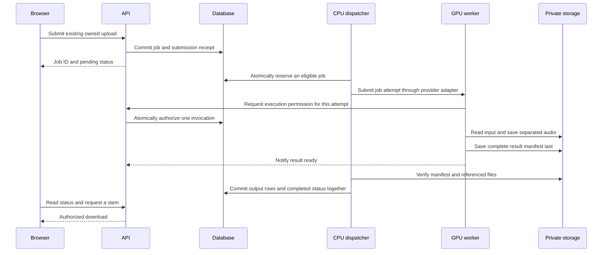

# Durable job execution for the invited beta

Status: proposed design for review, 2026-10-02. This document changes no runtime
behavior. Hosting provider and monthly budget remain undecided; selecting this
design does not provision or purchase anything.

## Recommendation and reading guide

Keep accepted work in the database, run a separate CPU dispatcher, and execute
inference in a GPU worker. Start with one active attempt globally. Prove the
contract locally with a fake worker before integrating private object storage and
a selected GPU provider.

Read sections 1-3 first: the current gap, component responsibilities, and normal
flow. Sections 4-7 specify the recovery rules we will implement in small stages.
The final sections describe tradeoffs, acceptance checks, and learning milestones.

## 1. What the code does today

In local mode, `POST /jobs` checks authentication/ownership and the per-user
unfinished-job allowance, inserts a pending job, commits, and adds `process_job`
to FastAPI's `BackgroundTasks`. The model is loaded in the API lifespan.

`process_job` loads the upload, marks processing, runs separation, then inserts
output rows and marks completed in one database transaction. Ordinary exceptions
attempt to mark failed. These are useful foundations, but process termination
cannot be handled by an exception handler that no longer runs.

The job has only `id`, `upload_id`, and `status`. There is no execution owner,
attempt history, deadline, or restart scanner. Two calls to `process_job` are not
protected by an atomic claim. Outputs are written directly into a job directory,
and output rows contain absolute filesystem paths. A retry can encounter partial
files or existing `(job_id, stem)` rows. Current fake inference fixtures return
paths without creating output files, so completion tests will also need real
small WAV artifacts when publication starts verifying their contents.

A concrete failure: commit a pending job, then stop the API before its background
task starts. The job survives in SQLite, but nothing discovers it after restart.
A stop during inference can similarly leave a job marked processing indefinitely.
Both also continue to consume the user's unfinished-job allowance.

The CPU container currently uses disabled mode and rejects new jobs with 503;
it has not been running this local inference path during our container exercise.
FastAPI describes its background tasks as work after the response, and recommends
separate tools for heavy computation across processes or servers.
[FastAPI background tasks](https://fastapi.tiangolo.com/tutorial/background-tasks/)

Relevant existing files:

- [Job submission and downloads](../backend/app/routers/jobs.py)
- [Current processing function](../backend/app/processing.py)
- [Job persistence and admission](../backend/app/repositories/jobs.py)
- [Models](../backend/app/db_models.py)
- [Storage paths](../backend/app/storage.py)
- [Inference wrapper](../backend/app/separation.py)
- [Existing processing tests](../backend/tests/test_processing.py)

## 2. Responsibilities and deployment boundary

| Component | Responsibility | State it owns |
| --- | --- | --- |
| API | Authenticate users, accept uploads/jobs, expose status and authorized downloads | Submission records, jobs, publication metadata |
| CPU dispatcher | Discover eligible work, reserve attempts, submit/reconcile execution, finalize results | Durable attempt/dispatch records |
| GPU worker | Obtain execution permission, read input, run inference, save a result manifest | Temporary workspace and durable attempt outputs |
| Private storage | Exchange uploads and outputs across machines | Audio objects and result manifests |

The dispatcher is a separate process. It survives an API container replacement
when its own process stays running, and reconstructs its work from the database
when it also restarts. A supervisor must restart these services; persistence
alone does not start a stopped process.

For the SQLite beta, API and dispatcher run on the same CPU host with the same
locally attached database. Transactions are short; no database lock is held while
calling a provider, transferring files, loading the model, or running inference.
The remote GPU worker communicates through authenticated control operations and
private storage. It does not mount or open the SQLite database remotely.
SQLite's documentation recommends keeping database access on the machine holding
the file or using a client/server database for remote clients.
[SQLite network guidance](https://www.sqlite.org/useovernet.html)

This requires a host that supports the dispatcher and persistent local storage.
Do not assume two independently hosted services can attach the same disk. If the
chosen host cannot support this topology, select a network database such as
PostgreSQL and revisit transaction/isolation behavior before implementing that
hosting adapter. Horizontal API replicas are outside the initial SQLite design.

For local contract tests, a fake worker uses a disposable local filesystem. A
later same-host GPU runner can use shared audio storage; hosted GPU workers need
private object storage because a Docker named volume is local to its Docker host.

## 3. Successful job, step by step

1. Uploads are validated and durably stored before they can be used for remote
   processing. If storage fails, submission cannot reference an unavailable input.
2. The API commits accepted work before responding. The public response remains
   the current 200 initially, with pending status; acceptance does not mean done.
3. The dispatcher periodically scans committed eligible jobs. There is no
   separate mandatory in-memory notification between acceptance and discovery.
4. It reserves one attempt in a short transaction and records submission intent
   before contacting the execution adapter.
5. The worker obtains permission for that exact attempt and invocation before
   inference. It uses a private workspace and writes outputs under its own prefix.
6. It stores all required files, then an immutable manifest containing their keys,
   sizes and SHA-256 hashes. The manifest is evidence of a complete output set.
7. The dispatcher verifies results and commits output rows plus completed status
   together. Downloads remain authorized through the existing job/upload owner.

This avoids the current commit-to-background-task gap. Sending to another system
still has a separate acknowledgement gap; section 5 handles it. Database commit
plus external notification is a general dual-write problem described by the
[transactional outbox pattern](https://docs.aws.amazon.com/prescriptive-guidance/latest/cloud-design-patterns/transactional-outbox.html).
Here the committed job is the work item scanned by the dispatcher. A separate
outbox table becomes useful if we later introduce a broker/event stream.

## 4. Persistent state and claiming work

Keep the public statuses `pending`, `processing`, `completed`, and `failed`.
Pending includes waiting for a worker/cold start; processing begins when an
invocation is authorized. Completed and failed are terminal for that job.
A retry is another attempt under the same job, while an explicit new user request
can create a new job. Both pending and processing continue to count toward quotas.

Proposed schema additions (exact names belong to the schema implementation):

| Record | Information to persist |
| --- | --- |
| Job | Execution backend, created/updated timestamps, next eligible time, active attempt reference, bounded retry policy, safe public error code |
| Submission receipt | User ID and idempotency key, request fingerprint, job ID; unique per user/key |
| Job attempt | Job ID/attempt number, phase, dispatcher owner/generation, invocation ID, heartbeat/deadline, provider reference, expected storage prefix, terminal outcome, scoped credential verifier |

UTC timestamps come from the control side, not untrusted worker clocks. Useful
indexes cover eligible jobs and active attempts. Allowed phases/transitions and
uniqueness rules must be enforced in repository transactions and appropriate
schema constraints, rather than by assigning arbitrary status strings.

A queued-mode client can send an `Idempotency-Key`: a unique identifier it reuses
when retrying the same HTTP submission. The receipt and job are committed in the
same transaction. Same user/key and same request return the original job without
using another quota slot; same key with a different request returns 409. Clients
without a key retain current new-job-per-request behavior; the future UI supplies
one. Concurrent replays must converge on the unique receipt, including when the
user's quota is now full. Lost HTTP responses are different from lost GPU dispatch
acknowledgements, so both need handling.

Claiming is atomic. For SQLite, acquire a short write transaction, check the
persisted global reservation, choose the oldest eligible queued job, and create
its attempt/reservation together. Competing dispatchers must not both succeed.
Implement and test explicit write-transaction semantics (for example
`BEGIN IMMEDIATE`) and bounded handling of database-busy errors. Do not copy a
PostgreSQL row-lock recipe into SQLite.
[SQLite transaction semantics](https://www.sqlite.org/lang_transaction.html)

Start with one global reservation. Reserved, submitting, submitted, running,
result-ready and uncertain attempts all occupy it. Claim, heartbeat, failure and
publication updates require the current attempt and owner/generation; stale
updates cannot take authority back. Dispatcher expiry before submission can be
reclaimed with a new generation. A stale dispatcher cannot transition that
reservation to submission.

Migration preserves completed jobs/output paths. Existing pending/processing
jobs are labelled legacy and excluded from the new queue until intentionally
reconciled; deploying the migration must not silently rerun old work. Use an
execution-backend field to distinguish legacy jobs from new queued jobs.

## 5. Worker contract and uncertain submissions

The execution adapter exposes submit, inspect, and stop/cancel-and-confirm
operations. Inspection distinguishes queued, running, terminal, and unknown.
A timeout, missing reference, or expired provider status is unknown, not proof
that execution stopped. Provider-specific schemas stay in the adapter.

Submission contains a protocol version, job/attempt IDs, an absolute authorization
deadline, input identity/hash, expected output prefix, model/configuration version,
and a scoped control credential. Input/output transfer capabilities are supplied
or refreshed only for the current authorized attempt. No user JWT, password hash,
bucket-wide credentials, arbitrary download URL, or remote local-file path is
required in the payload.

Control operations authorize execution, report heartbeat, and report result/error.
Use HTTPS and credentials distinct from user login secrets, scoped to an attempt;
persist credential verification state so API replacement does not invalidate an
active worker. Grant one invocation atomically. Different invocations receiving
the same delivery cannot both infer. Heartbeat/result notifications may be
repeated; terminal state and an already published identical manifest are stable.
Old attempts and conflicting manifests are rejected. Secrets/signed URLs are
excluded from logs. A credential identifies permission to report, not proof that
files are present: finalization still validates the result.

Persist `submitting` before the network call. If acceptance returns, persist the
provider reference. If the response is lost, preserve the attempt as uncertain,
keep its reservation, and look for its worker registration, result manifest, or
provider correlation information. Do not blindly submit another job.

The chosen provider must demonstrate a way to reconcile ambiguous acceptance, or
we use the conservative fallback: pause that reservation for operator inspection
until prior execution is confirmed stopped. An attempt deadline prevents late
workers from receiving new inference permission, but does not prove already
running work has stopped. Lack of heartbeat is suspicion, not a death certificate.
If uncertainty persists, expose it in operational logs/state rather than silently
charging for repeated submissions. This trades availability for bounded duplicate
work. It is a provider-selection gate, not a promised SDK capability.

Runpod is a candidate, not a selection. Its documentation describes asynchronous
submission/status operations and finite result retention; these do not by
themselves demonstrate submission idempotency after losing the returned job ID.
The adapter needs a targeted test. Durable audio/manifest storage must outlive
provider result retention.
[Runpod request lifecycle](https://docs.runpod.io/serverless/endpoints/send-requests)

The target is repeatable delivery with one authorized current invocation and one
published result set. Inference can still rerun after a confirmed interruption;
we do not claim exactly-once GPU execution or zero duplicated billing. Configure
and verify a provider worker cap of one and single-inference handling, plus hard
execution/queue limits. This remains separate from a user's two unfinished-job
allowance. Provider timeouts must be tested for actual termination behavior.
[Runpod endpoint settings](https://docs.runpod.io/serverless/endpoints/endpoint-configurations)

## 6. Recovery and retry rules

| Event | Recovery rule |
| --- | --- |
| API stops after committing acceptance | Restarted dispatcher discovers the committed job; client reuses its submission key if the response was lost |
| Dispatcher stops before submission intent | Reclaim its reservation using generation checks; stale owner cannot submit |
| Submission response is lost | Preserve uncertain state and reconcile; do not release the slot or assume rejection |
| API stops while GPU work runs | Worker saves durable results and retries its notification; dispatcher can discover the manifest after restart |
| Worker stops midway | Confirm it stopped, retire its attempt, then retry within budget using a new attempt/prefix |
| Files exist but manifest is incomplete/missing | Keep them unpublished; after confirmed interruption, retry or fail; clean abandoned files later |
| Complete manifest exists but DB finalization fails | Retry verification/publication using that manifest, without repeating inference |
| Completion notification repeats | Identical current result is acknowledged without duplicate output rows |
| Old attempt reports success/failure late | Reject its authority; it cannot overwrite the current or terminal job |

Propose at most two execution attempts per job (one automatic retry) for the beta.
Known interruption and transient transfer errors can use bounded backoff. Missing
input, invalid output, incompatible model and repeatable inference/OOM failures
should end with a clear error, rather than blindly spending another GPU attempt.
Publication/notification retries do not consume another inference attempt.

Queue lifetime, worker deadline, heartbeat interval, backoff, and transfer limits
must be configurable and calibrated using local and chosen-provider measurements.
A maximum audio duration is an input limit, not a safe execution-time estimate.
A local runner enforces its deadline with process supervision and confirmed exit;
a hosted adapter must demonstrate equivalent termination/reconciliation.
Terminal provider failure alone does not override an already validated, published
result. Every terminal transition verifies current authority in one transaction.

## 7. Files, manifests, and publication

Use keys such as `uploads/<upload-id>/input.wav` and
`jobs/<job-id>/attempts/<attempt-id>/<invocation-id>/<stem>.wav`. Original user
filenames are display metadata. They never determine arbitrary filesystem paths
or private storage destinations.

For a local runner, write to an attempt workspace and make finalized files
immutable before publishing a manifest. For object storage, upload files first
and the manifest last. In both cases, a database transaction cannot roll back
filesystem/object writes. Failed attempts can leave unpublished objects; cleanup
is a separate bounded retention operation.

Unique prefixes alone do not prevent overwriting an object. The storage adapter
must provide create-only writes or record immutable object versions, and serving
must select exactly the published identity. Local finalized artifacts must never
be rewritten by retries. An older invocation cannot change a published result.
Verify these capabilities for the selected backend; S3 documents conditional
writes, but another S3-compatible service must be checked separately.
[S3 conditional writes](https://docs.aws.amazon.com/AmazonS3/latest/userguide/conditional-writes.html)

Finalization checks the current attempt, protocol/model configuration, required
stem set, unique permitted stems, expected key prefix, nonempty valid WAV files,
size limits, and verified hashes. Use bounded reads/transfers. Insert the complete
output set and completed status in one transaction. A failed commit leaves no
partially published output rows; the durable manifest permits retry.

Hosted output metadata needs storage keys/backend information rather than a GPU
machine's absolute path. Existing path-based outputs remain downloadable during
migration. The API continues to check ownership before streaming an object or
issuing a short-lived download URL. Buckets remain private; URLs are capabilities
with bounded lifetimes and supported size/transfer controls. Choose and verify
the exact storage API/security mechanism in its implementation stage. If an input
link expires while queued, refresh it through the authorized control operation.

## 8. Tradeoffs and alternatives

| Approach | Why choose it | Cost/limitation |
| --- | --- | --- |
| Database queue + dispatcher (recommended beta) | Accepted work and admission share one transaction; uses existing metadata storage | We own claim/recovery logic; polling adds delay; SQLite ties control services to one host |
| Celery/RQ + durable broker | Established task tooling and more worker scaling options | Broker persistence/operations and commit-to-send coordination still need design |
| Provider-managed queue alone | Provider schedules available GPU workers | Application must still reconcile submissions, preserve outputs, authenticate results, and enforce budget |

Use one transport adapter initially, with a deterministic fake for tests. Avoid
building a general scheduling framework. Revisit PostgreSQL or a broker when host
constraints, measured queue load, multiple control hosts, or operational costs
justify it. A managed queue is not a substitute for application-level publication
and retry rules.

## 9. Small implementation stages and acceptance checks

1. **Persistent job/attempt schema.** Add migration, request receipts, backend
   identity, timestamps and repository state rules. Test upgrades on a populated
   disposable database, old output compatibility, quota-safe concurrent receipt
   replay, and existing authentication/ownership behavior. No worker launch yet.
2. **Atomic reservation and authority.** Implement SQLite claims, generation
   checks, retries and deadline decisions. Competing processes must yield one
   reservation; stale completion/failure and terminal reversal must be rejected.
3. **Separate runner and queued API mode.** Add CPU dispatcher/runner commands and
   a fake execution adapter. Queued API commits work without loading a model or
   scheduling in-process inference. Disabled mode retains its existing 503 behavior.
   The local adapter exercises repository authority operations directly; remote
   HTTP control wrappers arrive in stage 6.
4. **Attempt outputs and publication.** Add manifests, isolated workspaces,
   validated output publication and idempotent finalization. Verify that partial
   files are inaccessible and a publication retry does not invoke inference again.
   Update fake inference to produce small real WAV files; metadata-only fake
   manifests no longer demonstrate a valid completed result.
5. **Local interruption proof.** Use disposable database/audio storage and actual
   subprocess termination. Stop API after acceptance, stop dispatcher at submission
   boundaries, kill fake worker midway, replay deliveries/results, and restart.
   Verify bounded recovery, preserved ownership and exact output bytes.
6. **Private remote storage and control operations.** Implement attempt-scoped
   execution/heartbeat/result permission, storage keys and transfer limits. Test
   expired links, denied credentials, forged/conflicting results, API replacement,
   and legacy local downloads. No paid provider needed for contract tests.
7. **Provider comparison and one adapter.** Refresh cost estimates, select a
   provider/budget with the user, and prove ambiguous submission, cancellation,
   timeout, lost callbacks, retention and concurrency behavior. Adapt the design
   if the chosen platform cannot provide the required control topology.
8. **GPU image and end-to-end proof.** Lock/provision inference dependencies and
   model assets; run real GPU separation using the new worker, then verify upload
   -> asynchronous status -> owned downloads. Measure cold/warm times, GPU/CPU
   memory and output sizes. Paid deployment follows the agreed hosting choice.

A local fake proves the job protocol and failure handling. GPU-container and
remote-host tests provide separate evidence. The full worker milestone is done
when accepted jobs remain recoverable across relevant process restarts, published
outputs belong to one valid attempt, concurrency/retries are bounded, and the real
GPU path is demonstrated. Invited admission, frontend, backups and retention remain
release requirements in the broader deployment work.

## 10. Review and learning checkpoints

This stage is complete when the proposed flow and recovery tradeoffs have been
reviewed; it is not an implemented reliability guarantee. The next implementation
stage is schema/repository work, introduced separately before edits.

After the whole worker milestone, ask the user to explain in their own words:

- Why does a committed pending row survive an API restart but a background task not?
- How do two dispatchers avoid claiming the same work or exceeding the global cap?
- Why is a heartbeat timeout insufficient permission to start replacement GPU work?
- What happens when submission succeeds but its acknowledgement is lost?
- Why do completed files and completed database state need a publication protocol?
- Which retries repeat inference, and which should only repeat finalization?
- How do a per-user admission limit and global inference limit differ?
- Why can a remote worker use private audio storage but not our local SQLite file?

General lesson: persist the work, the right to execute it, and the evidence of its
result. Design every externally visible state transition around interruption and
repeated delivery, rather than assuming each operation happens once.
